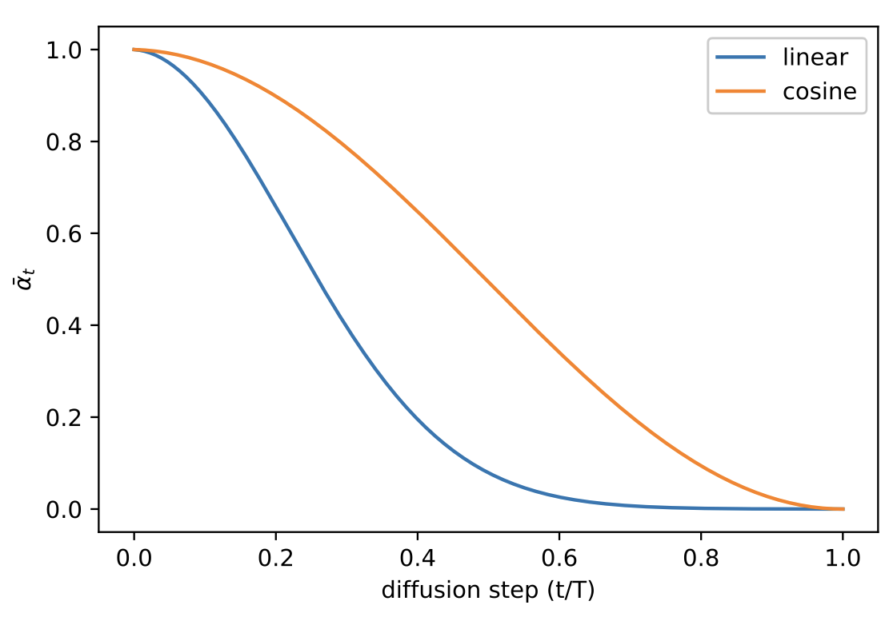
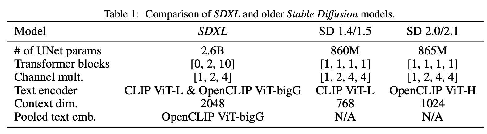
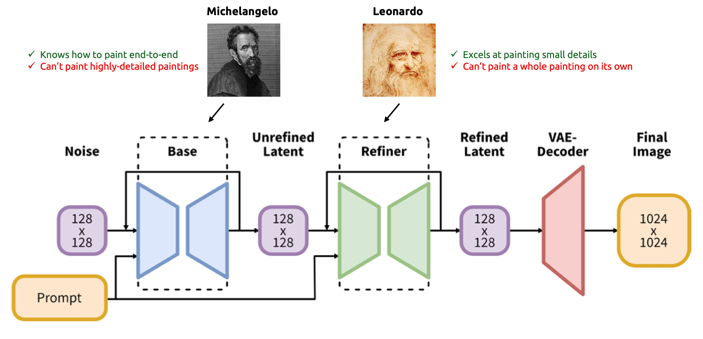
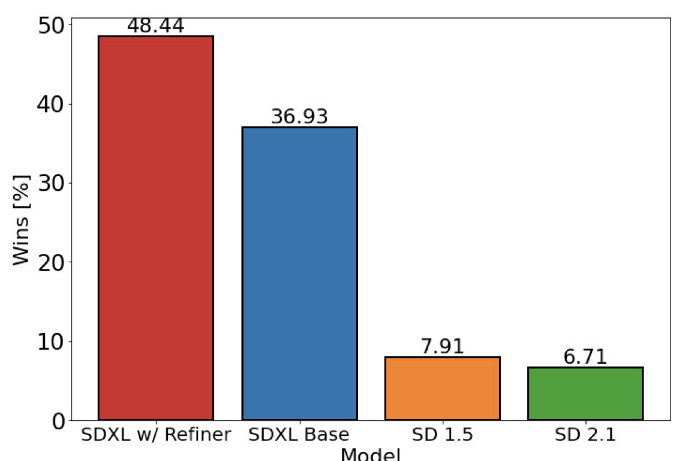

# **Overfit#2:** From DDPMs to Stable Diffusion XL


<!-- more -->

*From DDPMs to Stable Diffusion XL ...*

## Motivation

In the **[previous post](01_ddpm_1.md)**, we explored DDPM, the foundational paper from [Ho & al. (2020)](https://arxiv.org/abs/2006.11239) that paved the way for Diffusion Models.

The DDPM paper was published back in 2020: lots of progress has been made since then. In this second post, we will deep dive into the improvements added since. In the end, we will uncover the key additional components of SDXL - **Stable Diffusion XL** - the most downloaded text-to-image architecture on Huggingface.

!!! note "Table of content"
    - [Improved DDPMs (OpenAI)](#improved-ddpms-openai)
    - [High-Resolution Image Synthesis with Latent Diffusion Models](#high-resolution-image-synthesis-with-latent-diffusion-models)
    - [Stable Diffusion](#stable-diffusion)
    - SDXL

---

## Improved DDPMs (OpenAI)

In February 2021 comes the first major upgrade to DDPMs ... ["Improved DDPMs"](https://arxiv.org/abs/2102.09672) (a really creative name btw ...).

Published by OpenAI research scientists, this paper focused on squeezing extra performance from DDPMs through **3 small improvements**: changing the noise scheduler, learning the variances, and importance sampling.

<figure markdown>
  { width="400" }
  <figcaption>Class-conditional ImageNet 64 × 64 generated samples.</figcaption>
</figure>

### Cosine noise scheduling

!!! quote "Refresher from the [post about DDPMs](./01_ddpm_1.md)"
    $\beta_t$ = variance of noising step $t-1 \rightarrow t$

    $\bar{\alpha_t}$ = **how much information the noised image still contains** after $0 \rightarrow 1 \rightarrow 2 \rightarrow \cdots \rightarrow t$

DDPMs use a **linear noise schedule** for the forward diffusion process: the variances $\beta_t$ increase proportionally with the time step $t$ (from $10^{-4}$ to $0.02$).

[Nichol & Dhariwal (2021)](https://arxiv.org/abs/2102.09672) showed that (1) the image is actually destroyed too fast and that (2) the last noising steps don't do much. As you can see on the plot below, with a linear scheduler (blue), the information $\bar{\alpha_t}$ is in fact lost progressively, but mostly during the first steps (left), while the $\bar{\alpha_t}$ comes to a plateau on the last quarter of steps.

<figure markdown>
  { width="400" }
  <figcaption>Cosine noise scheduling enables achieving more linear alphas.<br>From <a href="https://arxiv.org/abs/2102.09672"> Improved DDPMs (2021)</a> </figcaption>
</figure>

To mitigate these issues, [Nichol & Dhariwal (2021)](https://arxiv.org/abs/2102.09672) replaced the linear noise scheduling with a cosine noise scheduling (orange). The biggest advantage of this new noise scheduling is that (1) the image is much less modified during the first noising steps / last generation steps, thus helping the model in its refinement final steps, and (2) the image noising is almost linear during the intermediate steps. This led to better performance and helped make every denoising step useful.

<figure markdown>
  { width="600" }
  <figcaption>Using cosine noise scheduling, we get a much smoother noising process. From <a href="https://arxiv.org/abs/2102.09672"> Improved DDPMs (2021)</a> </figcaption>
</figure>

### Learning variances

In DDPM, [Ho. al (2020)](https://arxiv.org/abs/2006.11239) fixed the reverse process variances because learning them made the training unstable. Improved DDPM's authors claim it causes performance loss, as we don't optimize the exact loss function. Thus they make variances learnable. Yet, to mitigate the instability issues, they introduce a **hybrid loss**, made of the simplified DDPM loss + the exact loss $L_{vlb}$ that acts as a regularization term:

$$
L_{hybrid} = L_{simplified} + \lambda L_{vlb} \quad \text{where } \lambda = 0.001
$$

<figure markdown>
  { width="600" }
  <figcaption>The hybrid loss (orange) is more stable and gives better results than the exact loss (blue). Using importance sampling further stabilizes the training. </figcaption>
</figure>

Additionally, [Nichol & Dhariwal (2021)](https://arxiv.org/abs/2102.09672) found it was better to guess the variances $\Sigma$ using an interpolation trick. As $\Sigma$ is bounded by $\beta_t$ and $\tilde{\beta_t}$, they trained the model to guess an interpolation vector $v$ between these two bounds:

$$
\Sigma_\theta(\mathbf{x}_t, t) = \exp \left( v \log{\beta_t} + (1-v) \log{\tilde{\beta_t}} \right)
$$

### Importance sampling

[Nichol & Dhariwal (2021)](https://arxiv.org/abs/2102.09672) analyzed on which steps the denoising model struggled the most. They showed that most of the loss is imputable to the first diffusion steps / last denoising steps. Thus they used **importance sampling** to mitigate this weakness.

The core idea of importance sampling is to show the model more samples on which it struggles. It is like preparing for an exam. In theory you should spend as much time on each chapter (uniform sampling). But in practice, you know that you perform poorly on some specific chapters, so you spend more time studying them (importance sampling).

At training time, [Nichol & Dhariwal (2021)](https://arxiv.org/abs/2102.09672) sampled $t$ values with a probability proportional to the average mean squared error you made on the 10 latest samples for this time step:

$$
L_{vlb} = E_{t \sim p_t} \left[ \frac{L_t}{p_t}\right] \, \text{where } p_t \propto \sqrt{E[L_t^2]} \text{and } \sum p_t = 1
$$

Note that the authors mentioned that importance sampling helps when minimizing $L_{vlb}$ but not with $L_{hybrid}$.

<div class="grid cards" markdown>

- <figure markdown>
    { width="600" }
    <figcaption>Importance sampling slightly changes the training procedure</figcaption>
  </figure>
- <figure markdown>
    { width="600" }
    <figcaption>The first noising steps / last denoising steps are accountable for most of the loss</figcaption>
  </figure>

</div>

### Results

- **GANs competitors**: With these small improvements, improved DDPMs are on par with GANs in terms of NLL (negative log-likelihood), while achieving much better mode coverage. They showed it in another paper ["Diffusion Models Beat GANs on Image Synthesis" (2021)](https://arxiv.org/abs/2105.05233).
- **Improved DDPMs allow for skipping some inference steps**: using 50 steps at inference with adapted variances instead of 4000 during training, they achieved a $\times 80$ faster inference while maintaining the same sample quality. Generating images is thus a matter of seconds instead of minutes which **makes diffusion models applicable to products!**
- **The scale potential:** They showed there was still room for improvement by scaling up the size of the models.

<figure markdown>
  { width="500" }
  <figcaption>The bigger the models the better the performance. And back in 2021, the plateau has not been reached yet ...</figcaption>
</figure>

---

## Stable Diffusion

The next major enhancement to DDPMs comes from a collaboration between Stability AI and RunWay: a paper entitled ["High-Resolution Image Synthesis with Latent Diffusion Models"](https://arxiv.org/abs/2112.10752) published in December 2021.

Eight months later, in August 2022, the same authors trained a model on a subset of the [LAION-5B](https://laion.ai/blog/laion-5b/) database and released [**Stable Diffusion**](https://github.com/CompVis/stable-diffusion), an 860M UNet and 123M CLIP ViT-L/14 text encoder architecture.

Released under the permissive [CreativeML OpenRAIL M license](https://github.com/CompVis/stable-diffusion/blob/main/LICENSE), the model is relatively lightweight and runs on a GPU with at least 10GB VRAM. And it introduces a completely new concept: **Latent Diffusion Models**.

<figure markdown>

  <figcaption>Images generated by Stable Diffusion v1<br>From the official <a href="https://github.com/CompVis/stable-diffusion.">Github repo</a></figcaption>
</figure>

### Latent diffusion models

Vanilla DDPMs denoise in the image space: they take an image as input, and they return a noise of the same dimension. I see two issues with it:

- **It is computationally expensive**: the dimensions are huge ($512 \times 512 \times 3$ for instance), can we be more efficient?
- **We work on pixel values**: it is a fine-grained task, is it really what we want? Let's say I want to generate a cat, I don't care if every single pixel value is perfect, I just want the overall image to look like a realistic cat.

!!! quote "What do Latent Diffusion Models do differently?"

**Latent Diffusion Models** (LDM) run the denoising process **in a latent (embedding) space instead of the pixel space**. Instead of denoising the image itself, the denoising is made on a compressed embedded version of the image.

Latent Diffusion Models (1) embed the image into a highly compressed feature map using an encoder $\mathcal{E}$, (2) apply the denoising process on the embedding guided by a conditioning text/image/sequence, (3) decode the embedding to recover the image using a decoder $\mathcal{D}$.

<figure markdown>
  { width="500" }
  <figcaption>Stable Diffusion architecture. Extended from <a href="https://arxiv.org/abs/2112.10752" title="Stable Diffusion paper"> Rombach, Blattmann & al. (2022)</a> </figcaption>
</figure>

!!! quote "WOH! That's an ugly architecture, what is going on here?"

Let me split the aforementioned architecture to make things easier. The typical LDM architecture is made of 4 parts.

<figure markdown>
  
  <figcaption>The 3 parts of a LDM. </figcaption>
</figure>

1. **Encoder**: the authors used pre-trained regularized Variational Auto Encoders (VAE). They tested two flavors of VAEs, [vq-VAEs](https://arxiv.org/abs/1711.00937) and KL-VAEs. Their purpose is simple: compress the image into a dense embedding $z$, in a meaningful continuous embedding space (enforced by VAEs).
2. **DDPM**: once the image is embedded, the whole denoising process is applied on $z$ instead of $x$ like in vanilla DDPMs. That is why we call them **Latent** diffusion models.
3. **Conditioning**: as in DDPMs, you might want to condition the image generation with some additional input. For text prompts, a common choice is a CLIP model. The conditioning embedding is then infused in the denoising process using [cross-attention blocks](./01_ddpm_1.md/#cross-attention).
4. **Decoder**: once denoised $z$ is converted back to the image space to recover an image $\tilde{x}$ using the decoder part $\mathcal{D}$ of the pre-trained VAE.

An image is worth 1000 words, so here is a quick recap of the LDM's training and inference procedures:

<figure markdown>
{ width="700" }
  <figcaption>At inference time, no need of the encoder and of the forward diffusion process. </figcaption>
</figure>

### Results

- **Better images**: The model focuses on semantics, because the "high-frequency, imperceptible details are abstracted away".

<figure markdown>
{ width="500" }
  <figcaption>LDM-4 beat previous architectures on CelebA-HQ dataset and perform on par with GANs on other benchmarks. From <a href="https://arxiv.org/abs/2112.10752" title="Stable Diffusion paper">paper</a></figcaption>
</figure>

- **Better mode coverage than GANs**: You can measure the mode coverage of a generative model using precision/recall as shown in this cool paper ["Improved Precision and Recall Metric for Assessing Generative Models"](https://arxiv.org/abs/1904.06991)
- **Compress by 4-8:** Compressing the input image dimension by a factor $4$ to $8$ gives the greatest FID and Inception Score metrics.
- **Higher throughput**: Compressing the input saves a lot of computing, as shown here:

<figure markdown>
{ width="700" }
  <figcaption>The higher the compression factor, the faster the compute, and thus the higher the throughput. Different markers indicate {10, 20, 50, 100, 200} sampling steps using DDIM (more on that in another post), from right to left along each line. Benchmark datasets: CelebA-HQ (left) and ImageNet (right).</figcaption>
</figure>

---

## SDXL

What happens if the team that created Stable Diffusion has more resources at its disposal to train a bigger, more powerful model? You guessed it: **Stable Diffusion XL**!

Published in July 2023, the official release paper ["SDXL: Improving Latent Diffusion Models for High-Resolution Image Synthesis"](https://arxiv.org/abs/2307.01952) contains many great ideas. To my mind, the 3 main improvements are:

- **Scale up the model size** with a  $3 \times$ bigger UNet and a second text encoder
- **Micro-conditioning**: Novel conditioning schemes and multiple aspect ratios training
- **Refinement model**: Use a second network to refine the samples

<figure markdown>

  <figcaption>Samples generated by SDXL</figcaption>
</figure>

### Bigger models

The ["Improved DDPMs"](https://arxiv.org/abs/2102.09672) model showed further **scaling up the model size** would give promising results. SDXL's authors thus use a much bigger 2.6B parameters UNet model. For comparison purposes, the latest version of Stable Diffusion was "only" 860M. They also rework the way the cross-attention blocks are placed within the model, putting **more blocks in the deeper layers**.

<figure markdown>
{ width="500" }
  <figcaption>SDXL is 3 times bigger than the latest releases of SD. The text encoding part is especially bigger bc of the larger context dimension.</figcaption>
</figure>

In parallel, they used not one but **2 text encoding models**: OpenCLIP ViT-bigG in combination with CLIP ViT-L. They essentially encoded the text prompt with both then concatenated the embeddings into one. This choice is motivated by the lack of expressiveness of the smaller encoding models, which became a bottleneck, as shown by the ever-increasing context dimension.

$\rightarrow$ That's why the latest image generation models tend to have bigger and bigger encoding sub-models.

### Micro-conditioning

- **Condition on the image size**: because of the image compression step, SD needed its training images to be big enough. To avoid throwing away almost 30% of the training dataset, SD upsampled all images to a minimum size, but the model tend to blur high-resolution images at inference time because it learned the blurry aspect of the small-resolution images ... The SDXL authors showed that you can achieve higher performance by conditioning the model on the image size. Therefore, the model can train on various image resolutions, without learning the blurry effect of the lower-resolution training images. In the end, at inference time, the user can set the "apparent resolution" of the outputs.

<figure markdown>
{ width="500" }
  <figcaption>The user can set the apparent resolution through size conditioning. From <a href="https://arxiv.org/pdf/2307.01952.pdf">SDXL</a></figcaption>
</figure>

- **Condition on the image crop**: as the training implies data augmentation including cropping, SD tended to generate cropped objects. To mitigate this issue, during training, SDXL is conditioned on the cropping applied to the image. At inference, this conditioning is set to $(0, 0)$ by default, as we usually want the generated object to be centered.

<figure markdown>
{ width="500" }
  <figcaption>The cropping conditioning helps reducing the risks of cropped samples. From <a href="https://arxiv.org/pdf/2307.01952.pdf">SDXL</a></figcaption>
</figure>

### Refiner

The core idea behind the refinement model of SDXL is to enhance the quality of generated images by **training a secondary DDPM** specifically for refinement tasks. This secondary model is trained **on the latest denoising steps**, allowing it to specialize in polishing and enhancing the details of images generated by the primary model.

<figure markdown>
{ width="700" }
  <figcaption>The biggest enhancement of SDXL is the addition of a refinement module</figcaption>
</figure>

Imagine **Michelangelo** painting a massive masterpiece, capturing the essence and overall structure of the artwork. Once the main composition is completed, he entrusts a friend **Leonardo** Da Vinci, proficient in intricate detailing, to refine and enhance specific elements of the painting.

Similarly, in SDXL, a **base DDPM** generates high-quality images, while the **refinement model** specializes in adding finer details and improving overall visual coherence. This approach ensures that the final output exhibits both the broad strokes and the subtle nuances necessary for a compelling and realistic image.

For instance, the picture right underneath shows how the output is improved and refined by the second model by using it for the 200 last denoising steps instead of the base UNet.

<figure markdown>
{ width="500" }
  <figcaption>Samples from SDXL without (left) and with (right) the refinement model.</figcaption>
</figure>

However, the refinement model introduces certain trade-offs, notably in terms of computational overhead. By employing two UNets, the system requires more VRAM, potentially increasing computational costs and resource requirements. Despite this drawback, the refinement model offers a tangible improvement in image quality.

### Additional ideas

Here are some other ideas implemented in SDXL I have no time to cover:

- **Improved the autoencoder**: used a bigger batch size (256 vs 9) and used exponential moving average for the weights $\rightarrow$ Better reconstructions
- **Multi-aspect training**: most LDM are trained on square images, while most real-world images are not $\rightarrow$ They propose a technique to finetune the model on images of variable shapes
- **Heterogeneous Distribution of Transformer Blocks**: Diverging from the conventional uniform distribution of transformer blocks seen in earlier models ([1,1,1,1]), SDXL employs a heterogeneous distribution ([0,2,4]). According to the authors, this "shifts the bulk of the transformer computation to lower-level features in the UNet".

### Results and limitations

- Users have a strong preference for SDXL+refiner outputs
- SDXL still encounters difficulties when rendering long, legible text
- Same for 3D objects with complex poses like hands

$\rightarrow$ The authors suppose that bigger text encoders, larger models and datasets will help further improve these models.

<figure markdown>
{ width="450" }
</figure>

### Code example

Stable Diffusion XL has risen as the go-to architecture for [text-to-image generation](https://huggingface.co/models?pipeline_tag=text-to-image) as you can see on HuggingFace. If you feel like experimenting a bit, HuggingFace hosts plenty of amazing fine-tuned models, released by the open-source community. For instance here is some code to run your own SDXL (from the [HuggingFace page of SDXL](https://huggingface.co/stabilityai/stable-diffusion-xl-base-1.0)).

You first select a base model and a refiner model:

```python
from diffusers import DiffusionPipeline
import torch

# load both base & refiner
base = DiffusionPipeline.from_pretrained(
    "stabilityai/stable-diffusion-xl-base-1.0", torch_dtype=torch.float16, variant="fp16", use_safetensors=True
)
base.to("cuda")
refiner = DiffusionPipeline.from_pretrained(
    "stabilityai/stable-diffusion-xl-refiner-1.0",
    text_encoder_2=base.text_encoder_2,
    vae=base.vae,
    torch_dtype=torch.float16,
    use_safetensors=True,
    variant="fp16",
)
refiner.to("cuda")
```

You then define how many steps you want, and what proportion should be run on the refiner:

```python
# Define how many steps and what % of steps to be run on each experts (80/20) here
n_steps = 40
high_noise_frac = 0.8

prompt = "A majestic lion jumping from a big stone at night"
```

Finally, run the predictions, and give the latent output of the base model to the refiner:

```python
# run both experts
image = base(
    prompt=prompt,
    num_inference_steps=n_steps,
    denoising_end=high_noise_frac,
    output_type="latent",
).images
image = refiner(
    prompt=prompt,
    num_inference_steps=n_steps,
    denoising_start=high_noise_frac,
    image=image,
).images[0]
```

## Conclusion

I hope you enjoyed this reading. In a near future, I plan to share some techniques to further speed up the generation process. So stay connected, and see you in the next one! 👋
