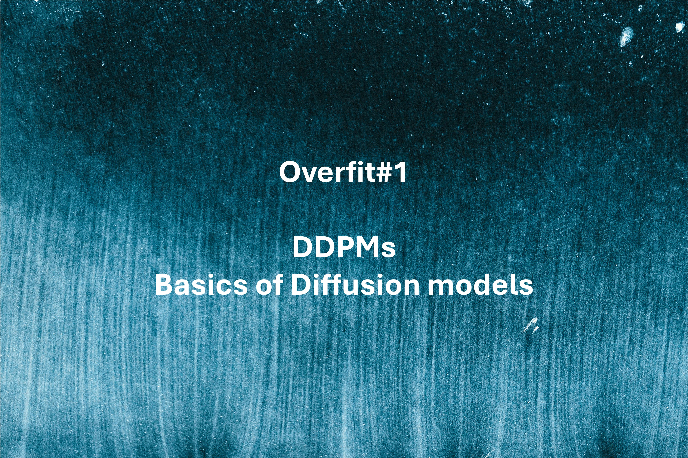
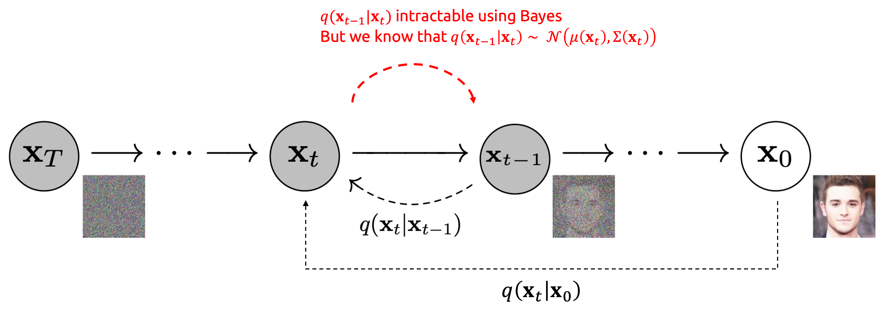

# **Overfit#1:** Denoising Diffusion Probabilistic Models - Basics of Diffusion models

<!-- more -->

*A deep dive into DDPMs.*

## Motivation - The generation trilemma

**Diffusion models** are image generation deep learning models, able to generate highly-realistic images, usually from a text instruction. To put it briefly, they are to image generation what Large Language Models (LLMs) are to text generation.

Diffusion models took the world by storm in 2022. Since the release of open-source models (Stable Diffusion) and playgrounds (DALL-E from OpenAI, Midjourney), they have established themselves as the go-to solution to generate images.

<figure markdown>
  { width="400" }
  <figcaption>"A photograph of an astronaut riding a horse" From <a href="https://en.wikipedia.org/wiki/Stable_Diffusion" title="Wikipedia Stable Diffusion"> Stable Diffusion Wikipedia page</a>.</figcaption>
</figure>

When it comes to image generation, one expects three essential characteristics from a generative model:

- **High-quality outputs**: the model should produce realistic images with a high level of detail.
- **Diversity** (or Mode Coverage): the model should generate a variety of images, not solely a few hyper-realistic ones.
- **Fast sampling** (inference): we desire the generation process to be rapid and, of course, resource-efficient.

<figure markdown>
  { width="400" }
  <figcaption>The generation trilemma</figcaption>
</figure>

Back in 2020, most methods struggled to effectively address these three challenges simultaneously:

- VAEs: offered cost-effective inference and diverse samples but often resulted in low-quality output.
- GANs: provided efficient inference and [high-quality samples](https://thispersondoesnotexist.com) but proved challenging to train due to the dual-model architecture (discriminator VS generator), making them susceptible to mode collapse during training (where the model consistently generates the same few images).

In the following sections, I will walk you through **Denoising Diffusion Probabilistic Models** (DDPM) from [Ho & al. (2020)](https://arxiv.org/abs/2006.11239), which is the technological advancement responsible for the image generation revolution. As we will see, DDPMs allow for **diverse and high-quality sample generation**, but at the cost of **increased inference time** (mitigated later as we will see in future posts!).

!!! note "The 3+1 key concepts"

    1. [Inverting the diffusion process](#inverting-the-diffusion-process)
    2. The [simplified loss (level 1)](#loss-level-1)
    3. The [modified UNet architecture](#model-architecture)

    I could add a 4th point for the proof of the loss. It is pretty math-intense, so I keep it as an extra milestone for curious readers in [Loss (level 2)](#loss-level-2).

Ready? Let's begin!

---

## Diffusion

Diffusion Models generate images by **iterative refinement**. They slowly add random gaussian noise to an image, then learn to remove the noise to recover the image. Doing so, we get a model capable of generating images from random noise in multiple steps.

### Forward diffusion process

During the **forward diffusion process**, we add some gaussian noise to the image, iteratively. The image thus becomes more and more noisy. After hundred or thousands of steps, the resulting image is pure noise, all information being lost through diffusion.

<figure markdown>
  
  <figcaption>Image modified from source: <a href="https://arxiv.org/abs/2006.11239" title="Ho & al. (2020)"> Ho & al. (2020)</a></figcaption>
</figure>

Let us define $\mathbf{x}_0$ the original image, $T$ the number of diffusion steps and $t$ an intermediate time step. The noising process from image $t-1$ to $t$ is parametrized by a variance schedule $\beta_t$. Note that $\beta_t \ll 1$ as we want each step to add really little noise.

$$
q\left(\mathbf{x}_t|\mathbf{x}_{t-1}\right) = \mathcal{N}\left(\mathbf{x}_t ; \underbrace{\sqrt{1-\beta_t} \mathbf{x}_{t-1}}_{mean}, \underbrace{\beta_t}_{variance} \mathbf{I}\right) \iff \mathbf{x}_t = \sqrt{1-\beta_t} \mathbf{x}_{t-1} + \sqrt{\beta_t} \times \epsilon
$$

Nice! To sample $\mathbf{x}_t$, all we have to do is: draw a $\mathbf{x}_0$ from our image dataset, sample noise, add it, get $\mathbf{x}_1$. Repeat. Easy isn't it?

!!! quote "Ok, but this process is sequential, we need $\mathbf{x}_1$ to sample a $\mathbf{x}_2$, then $\mathbf{x}_3$ ... Can we do better?"

Yes we can! Thanks to the normal distribution properties, we can write $\mathbf{x}_t$ at any time step $t$ as a function of $\mathbf{x}_0$ and the variances $\left\{\beta_s\right\}_{s=1}^t$. Thus, knowing $\mathbf{x}_0$, we can sample $\mathbf{x}_t$ in only one noising process! This trick makes the noising process much faster as we remove the sequential bottleneck.

!!! bug ""
    $$q\left(\mathbf{x}_t|\mathbf{x}_0\right)=\mathcal{N}\left(\mathbf{x}_t ; \sqrt{\bar{\alpha}_t} \mathbf{x}_0,\left(1-\bar{\alpha}_t\right) \mathbf{I}\right) \quad \text {where } \alpha_t=1-\beta_t \, \text{and } \, \bar{\alpha}_t=\prod_{s=1}^t \alpha_s$$

??? quote "Proof"

    $$\begin{array}{rlr}\mathbf{x}_t &=\sqrt{\alpha_t} \mathbf{x}_{t-1}+\sqrt{1-\alpha_t} \mathbf{\epsilon}_{t-1} \quad \text {where } \mathbf{\epsilon}_{t-1}, \mathbf{\epsilon}_{t-2}, \cdots \sim \mathcal{N}(\mathbf{0}, \mathbf{I}) \\ &=\sqrt{\alpha_{t-1}}\sqrt{\alpha_{t-2}} \mathbf{x}_{t-2} + \underbrace{\sqrt{\alpha_t}\sqrt{1-\alpha_{t-1}}}_{\sigma_1} \mathbf{\epsilon}_{t-2} + \underbrace{\sqrt{1-\alpha_t}}_{\sigma_2} \mathbf{\epsilon}_{t-1} \end{array}$$

    Recall that $X_1 \sim \mathcal{N}(\mathbf{0}, \sigma_1^2\mathbf{I})$ and $X_2 \sim \mathcal{N}(\mathbf{0}, \sigma_2^2\mathbf{I})$ and $X_1$ and $X_2$ independant $\Rightarrow$ $X_1+X_2 \sim \mathcal{N}(\mathbf{0}, (\sigma_1^2+\sigma_2^2)\mathbf{I})$

    So here, the merged standard deviation is: $\sqrt{1-\alpha_t\alpha_{t-1}}$

    $$\begin{array}{rlr}\mathbf{x}_t & =\sqrt{\alpha_t \alpha_{t-1}} \mathbf{x}_{t-2}+\sqrt{1-\alpha_t \alpha_{t-1}} \overline{\mathbf{\epsilon}}_{t-2} \text {where } \overline{\mathbf{\epsilon}}_{t-2} \text { merges two gaussians} \\ & =\cdots & \\ & =\sqrt{\bar{\alpha}_t} \mathbf{x}_0+\sqrt{1-\bar{\alpha}_t} \mathbf{\epsilon} &\end{array}$$

!!! success "Nice! We now have a clever way to noise our images. Now, how can we reverse this process?"

### Backward denoising process

Reversing the forward process is basically guessing, from a noised image, what was the source image it was most probably created from. Put briefly, we want to find the most probable $\mathbf{x}_{t-1}$, knowing $\mathbf{x}_t$.

In more mathematical terms, during the forward process, we set an explicit expression for the **prior** $q(\mathbf{x}_t|\mathbf{x}_{t-1})$ and we now want the **posterior** $q(\mathbf{x}_{t-1}|\mathbf{x}_t)$.

Unfortunately, as often, the posterior is intractable. Bayes' theorem requires the evidence, which is hard to compute. For more details, Gregory Gundersen gives a great explanation [here](https://gregorygundersen.com/blog/2021/04/16/variational-inference/#:~:text=However%2C%20in%20many%20practical%20models,theorem%2C%20p(X)).

!!! quote "We need the posterior, but we can't compute it. How do we work around this problem?"

We can't compute the exact posterior, but we can learn a neural network $p_\theta$ to approximate $q(\mathbf{x}_{t-1}|\mathbf{x}_{t})$! If you are familiar with VAEs, training a decoder is the exact same idea.

Cherry on the cake: back in 1949, [Feller](#references) proved that the posterior is also a normal distribution $\mathcal{N}(\mu, \Sigma)$, **if $\beta_t$ is small enough (our case)**! That's great as we can take for granted the posterior normal distribution shape and let the model learn an approximate mean $\mu_\theta(\mathbf{x}_t)$ and approximated variance $\Sigma_\theta(\mathbf{x}_t)$.

Once we know the mean and variance of the posterior, starting from $\mathbf{x}_t$, we can sample a candidate $\mathbf{x}_{t-1}$, and then repeat until we reach $\mathbf{x}_0$.

<figure markdown>
  
  <figcaption>Image modified from source: <a href="https://arxiv.org/abs/2006.11239" title="Ho & al. (2020)"> Ho & al. (2020)</a></figcaption>
</figure>

??? quote "Quote from ["Deep Unsupervised Learning using Nonequilibrium Thermodynamics"](#references)"
    For both Gaussian and binomial diffusion, for continuous diffusion (limit of small step size $\beta$) the reversal of the diffusion process has the identical functional form as the forward process (Feller, 1949). Since $q(\mathbf{x}_{t}|\mathbf{x}_{t-1})$ is a Gaussian (binomial) distribution, and if $\beta_t$ is small, then $q(\mathbf{x}_{t-1}|\mathbf{x}_{t})$ will also be a Gaussian (binomial) distribution. The longer the trajectory the smaller the diffusion rate $\beta$ can be made.

## Loss (level 1)

What is the objective function to our problem? We want to estimate the parameters of the reverse probability distribution, given some observed data (our training dataset of $\mathbf{x}_0$ samples). That's a **likelihood maximization** problem! Negative log-likelihood (NLL) is thus the straightforward loss function we gonna minimize.

!!! warning "Here comes the hardest part of the paper"
    I will simplify things a bit so you get the intuitions. Then in [Loss level 2](#loss-level-2), I will refine my explanation based on the proof of the paper. So no worries if you feel like some arguments are missing in this section.

In their paper, [Ho & al. (2020)](https://arxiv.org/abs/2006.11239) used 2 tricks to simplify the loss:

- They don't learn the posterior variance. Instead they arbitrarily **fix** it: $\Sigma_\theta(\mathbf{x}_t, t) = \beta_t$.
- Because (1) $\mathbf{x}_t$ is known at inference time and because (2) $\mu$ and $\epsilon$ are linked by: $\mu_t=\frac{1}{\sqrt{\alpha_t}}\left(\mathbf{x}_t-\frac{1-\alpha_t}{\sqrt{1-\bar{\alpha}_t}} \epsilon_t\right)$, they re-parametrize the task, moving from a problem of predicting $\mu$ to **predicting $\epsilon$**.

Using these tricks, they showed that, maximizing the NLL is roughly equivalent to minimizing a Mean Squared Error (MSE) over the noise added during the forward process:

$$L_t^{\text {simple }}=\mathbb{E}_{t \sim[1, T], \mathbf{x}_0, \mathbf{\epsilon}_t}\left[\left\|\epsilon_t-\epsilon_\theta\left(\mathbf{x}_t, t\right)\right\|^2\right]$$

So, we can train our network in a supervised learning manner, to predict the normalized noise $\epsilon_t$.

<figure markdown>
  
  <figcaption>Pseudo code with extra annotations. Image source: <a href="https://arxiv.org/abs/2006.11239" title="DDPM"> Ho & al. (2020)</a></figcaption>
</figure>

## Inference

At inference time, things are pretty simple. Draw a random noisy sample $\mathbf{x}_T$ from a normal centered distribution. Then predict the mean of the posterior $q(\mathbf{x}_{T-1}\vert\mathbf{x}_T)$. As the posterior's variance is $\beta_T$, we know all the parameters of the posterior: we can sample $\mathbf{x}_{T-1}$.

We then repeat the process $T$ times, slowly changing the variance according to the variance schedule $\beta_s$. At the end of the process, we get our generated image $\mathbf{x}_0$!

Note that the denoising process is therefore **stochastic**! Starting from one seed, we can get multiple similar outputs!

<figure markdown>
  { width="350" }
  <figcaption>The inference is also stochastic as we draw denoised images step-by-step. Image from <a href="https://energy-based-model.github.io/Compositional-Visual-Generation-with-Composable-Diffusion-Models/" title="inference"> Source</a></figcaption>
</figure>

!!! quote "Why splitting the generation process into multiple steps? It sounds like over-engineering."

    I see two main reasons:

    1. **You make the task easier for the model**. Generating an image from pure noise is hard. To draw a parallel, generating directly is like drawing directly a painting on a blank sheet. When Leonardo Da Vinci painted the Mona Lisa, I am pretty sure he started by sketching the outlines and then refined its painting until it converges to its famous masterpiece. DPPMs do the same and split the generation task into multiple easier refinement sub-tasks.
    2. **Each denoising step is stochastic**. The generated image is the product of multiple random actions, so the model can generate multiple outputs from a fixed seed. I guess it is one of the reasons why DDPMs achieve better mode coverage.  That differs from VAEs and GANs, which of course draw a random seed, but their decoder/generative process is then deterministic.

## Model architecture

### U-Net backbone

DDPMs take an image as input and return a noise of the same shape as output.

This is typical of segmentation problems, in which one wants to classify every single pixel of an image. UNet is thus the straightforward architecture for our problem.

Yet, the vanilla UNet architecture is fully convolutional and can't manage an additional input to condition the denoising process (as a text prompt). That's why [Ho & al. (2020)](https://arxiv.org/abs/2006.11239) used a modified version of UNet called **PixelCNN+** from [Salimans & al.(2017)](https://arxiv.org/abs/1701.05517), to replace the fully-CNN backbone with a hybrid backbone made of both CNN blocks (ResNet) and Cross attention blocks.

<figure markdown>
  
  <figcaption>Model architecture <a href="https://www.mvrlink.com/diffusion-model-in-practice/" title="modelarchitecture">Source</a></figcaption>
</figure>

### Cross attention

Cross attention was first introduced in [Attention is all you need (2017)](https://arxiv.org/abs/1706.03762) as a bridge between the encoder and the decoder transformers.

The core idea of cross attention is to merge two sequences into one. Using the cross attention mechanism, the context of a sequence $seq_1$ gets infused into a sequence $seq_2$: the output has the same length as $seq_2$.

In DDPM, $seq_1$ could be a text prompt (encoded by a LLM like CLIP). $seq_2$ is the image ... To be more accurate, **the image is chopped into a sequences of subimages** so the attention block can handle it. Thus $seq_2$ is a "patchified" version of the feature map. That is the core idea of Vision Transformers [ViT(2020)](https://arxiv.org/abs/2010.11929). As the output of the cross attention block has the same length as the image, the output fused sequence can be unpatchified to recover the "CNN-like" feature map.

<figure markdown>
  
  <figcaption>Cross attention. Image modified from <a href="https://vaclavkosar.com/ml/cross-attention-in-transformer-architecture" title="crossattention">Vaclav Kosar</a></figcaption>
</figure>

### Specify the timestep

As we use the same network to denoise at all timesteps, the model needs extra info about the timestep $t$ it is at. In fact, the amount of noise to remove varies a lot through the backward process: a lot at the beginning ($T, T-1, T-2$ ...) but much less at the end (..., $2,1,0$) as it should only polish the final image.

In DDPM, the timestep is specified to the network using the Transformer sinusoidal position embedding from [Attention is all you need (2017)](https://arxiv.org/abs/1706.03762).

## Loss (level 2)

!!! note "Congrats for making it to this section!"
    Now let's justify the MSE loss I introduced in [Loss (level 1)](#loss-level-1). I will try to be as straight-to-the-point as possible and give you the key elements so you understand the loss simplification.

### ELBO

Like VAEs, the objective function is the likelihood, yet it is hard to maximize. A common workaround is to maximize a lower bound called the **ELBO** (Expectation Lower BOund) using Jensen's inequality. In optimization, we usually prefer minimizing things, so we will use the negative log of the likelihood instead (NLL), and minimize an upper bound $L_\text{VLB}$.

$$
\begin{aligned}
- \log p_\theta(\mathbf{x}_0)
&\leq - \log p_\theta(\mathbf{x}_0) + D_\text{KL}(q(\mathbf{x}_{1:T}\vert\mathbf{x}_0) \| p_\theta(\mathbf{x}_{1:T}\vert\mathbf{x}_0)) \\
&\leq \cdots \\
&\leq \mathbb{E}_{q(\mathbf{x}_{0:T})} \Big[ \log \frac{q(\mathbf{x}_{1:T}\vert\mathbf{x}_0)}{p_\theta(\mathbf{x}_{0:T})} \Big] = L_\text{VLB}
\end{aligned}
$$

It seems like the ELBO is much more complex than the NLL! But in practice, expanding the sum gives rise to a 3-part expression:

$$
L_\text{VLB} = \mathbb{E}_q [\underbrace{D_\text{KL}(q(\mathbf{x}_T \vert \mathbf{x}_0) \parallel p_\theta(\mathbf{x}_T))}_{L_T} + \sum_{t=2}^T \underbrace{D_\text{KL}( \overbrace{q(\mathbf{x}_{t-1} \vert \mathbf{x}_t, \mathbf{x}_0)}^{\text{gaussian}} \parallel \overbrace{p_\theta(\mathbf{x}_{t-1} \vert\mathbf{x}_t)}^{\text{gaussian}} )}_{L_{t-1}} \underbrace{- \log p_\theta(\mathbf{x}_0 \vert \mathbf{x}_1)}_{L_0} ]
$$

2 reasons why you should love this expression:

- $L_T$ can be ignored as it doesn't depend on $\theta$, because $\mathbf{x}_T$ is gaussian noise.
- $L_\text{VLB}$ is mostly KL divergence terms, comparing gaussian univariate distributions.

### Simplify the KL

Infact, after some extensive calculus, one can prove that the posterior conditioned over $\mathbf{x}_0$ - $q(\mathbf{x}_{t-1} \vert \mathbf{x}_t, \mathbf{x}_0)$ - is a also gaussian distribution:

$$
q(\mathbf{x}_{t-1} \vert \mathbf{x}_t, \mathbf{x}_0) = \mathcal{N}(\mathbf{x}_{t-1}; \tilde{\mu}(\mathbf{x}_t, \mathbf{x}_0), \tilde{\beta}_t \mathbf{I})
$$

where $\tilde{\mu}_t (\mathbf{x}_t, \mathbf{x}_0) = \frac{\sqrt{\alpha_t}(1 - \bar{\alpha}_{t-1})}{1 - \bar{\alpha}_t} \mathbf{x}_t + \frac{\sqrt{\bar{\alpha}_{t-1}}\beta_t}{1 - \bar{\alpha}_t} \mathbf{x}_0$ and $\tilde{\beta}_t = 1/(\frac{\alpha_t}{\beta_t} + \frac{1}{1 - \bar{\alpha}_{t-1}})$

That's great news because the KL-divergence between 2 univariate gaussian distributions has a closed form $\rightarrow$ [Proof](https://en.wikipedia.org/wiki/Kullback–Leibler_divergence#Multivariate_normal_distributions).

$$
D_{KL}(P_1 || Q_2) = \log \frac{\sigma_2}{\sigma_1} + \frac{\sigma_1^2 + (\mu_1 - \mu_2)^2}{2 \sigma_2^2} - \frac{1}{2}
$$

Recall that we fixed the posterior variance, so it doesn't depend on $\theta$. Thus:

$$
L_{t-1} = \frac{1}{2 \beta_t} \| \tilde{\mu}_t(\mathbf{x}_t, \mathbf{x}_0) - \mu_\theta(\mathbf{x}_t, t) \|^2
$$

### Reparametrize

!!! quote "We have expression of the targets $\tilde{\mu}_t(\mathbf{x}_t, \mathbf{x}_0)$. So we can train a model to learn the posterior means!"

Yes ... but there is one last step! [Ho & al. (2020)](https://arxiv.org/abs/2006.11239) showed that reparametrizing the loss over $\epsilon$ gives rise to an equivalent loss, which resembles Langevin dynamics and denoising score matching = they achieved to match two fields of research together! They also showed that "Predicting $\epsilon$ performs approximately as well as predicting $\tilde{\mu}_t$ when trained on the variational bound with fixed variances, but much better when trained with our simplified objective".

Replacing $\tilde{\mu}_t$ by its closed expression: $\tilde{\mu}_t (\mathbf{x}_t, \mathbf{x}_0) = \frac{\sqrt{\alpha_t}(1 - \bar{\alpha}_{t-1})}{1 - \bar{\alpha}_t} \mathbf{x}_t + \frac{\sqrt{\bar{\alpha}_{t-1}}\beta_t}{1 - \bar{\alpha}_t} \mathbf{x}_0$

and replacing $\mathbf{x}_0$ with the forward process trick: $\sqrt{\bar{\alpha}_t} \mathbf{x}_0+\sqrt{1-\bar{\alpha}_t} \epsilon, t \iff \mathbf{x}_0 = \frac{1}{\sqrt{\bar{\alpha}_t}}(\mathbf{x}_t - \sqrt{1 - \bar{\alpha}_t}\epsilon_t)$

We get:

$$
L_{t-1} = \frac{ (1 - \alpha_t)^2 }{2 \alpha_t (1 - \bar{\alpha}_t) \beta_t} \|\epsilon_t - \epsilon_\theta(\sqrt{\bar{\alpha}_t}\mathbf{x}_0 + \sqrt{1 - \bar{\alpha}_t}\epsilon_t, t)\|^2
$$

Final move, [Ho & al. (2020)](https://arxiv.org/abs/2006.11239) ditch the normalizing factor, as it improves the sample quality and makes the implementation simpler.

!!! bug ""
    $$
    L_{t-1} = \|\epsilon_t - \epsilon_\theta(\sqrt{\bar{\alpha}_t}\mathbf{x}_0 + \sqrt{1 - \bar{\alpha}_t}\epsilon_t, t)\|^2
    $$

---

## Limitations & Conclusion

You now have a deep understanding of how and why DDPMs work, congrats!

DDPMs are powerful tools that you can now add to your toolkit. Yet they are not the perfect solution either, at least in their vanilla version. Because of their iterative denoising process, DDPMs are slow ... really slow.

Researchers are still trying to lower the inference cost and time of DDPMs, for instance by skipping some denoising steps. More on that in a future post?

---

## References

[1] Jonathan Ho & al. [“Denoising diffusion probabilistic models.”](https://arxiv.org/abs/2006.11239) (2020)

[2] Weng, Lilian. ["What are diffusion models?"](https://lilianweng.github.io/posts/2021-07-11-diffusion-models/) (Jul 2021)

[3] Jascha Sohl & al. ["Deep Unsupervised Learning using Nonequilibrium Thermodynamics"](https://arxiv.org/abs/1503.03585) (2015)

[4] Feller, W. On the theory of stochastic processes, with particular reference to applications, Proceedings of the First Berkeley Symposium on Mathematical Statistics and Probability. (1949)

[5] Vaswani & al. ["Attention is all you need"](https://arxiv.org/abs/1706.03762) (2017)
